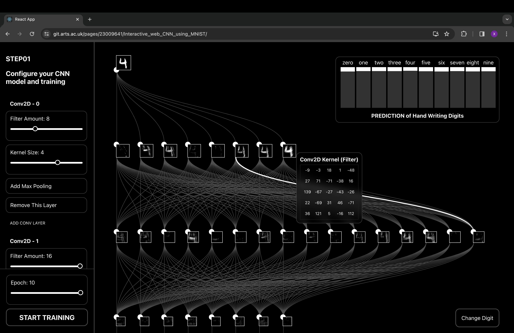

# Interactive_web_CNN_using_MNIST

Author: Xiang Li

Student ID: 23009641

This is the CCI_AI_For_Media_23_24 mini-project "Interactive_web_CNN_using_MNIST". 

The idea of this project is to build an interactive system on the web that visualizes the process of building, training, and evaluating a convolutional neural network (CNN) model. **Here is the link to the code repository:**

**https://git.arts.ac.uk/23009641/Interactive_web_CNN_using_MNIST**

## How to run and view

This project has been deployed on UAL Git. **Here is the link to experience this project online directly**: 
https://git.arts.ac.uk/pages/23009641/Interactive_web_CNN_using_MNIST/
(Since it requires GPU, I highly recommend you experience it on a desktop device with Chrome.)

You can also view the demo video on YouTube:
https://youtu.be/Jv0xe3rG5Dc

To run this project locally, clone or download the code of the branch `main`. Before running the code, make sure you have installed [Node and npm](https://nodejs.org/en/download/). Then open Terminal and follow the instructions below.

1. Get into the project directory:

   ```shell
   cd {your-path-to-project-directory}
   ```

2. For the first time to run this project, relevant node modules are required to be installed:

   ```
   npm install
   ```

3. After successfully installing node modules, run the app:

   ```
   npm start
   ```

   Then you can open your browser and view it at localhost. Here is a screenshot: 




## Code structure

This is a project built mainly based on react.js, TensorFlow.js and d3.js. As a result, it was bootstrapped with `create-react-app`. Here is the major code structure:

- package-lock.json
- package.json
- public
- **src**
  - **custom_style**
  - **machine_learning**
  - **user_interface**
  - **visualization**
  - **App.js**
  - other files


Some of the files are automatically generated by `create-react-app` and are files that support the project running, including package-lock.json, package.json and public. My major coding work is concentrated in the directory "src". Inside the directory "src", my work can be separated into five parts, referring to one file and five directories shown above. I left comments on all my original coding work, clarifying which part was written by myself and which part was modified by me based on some other sources.

### Part 1: Machine Learning Methods

The first part defines all the functions used in the machine learning process, including importing dataset, creating model, training model and some other operations. This part is located in the directory "machine_learning":

- **machine_learning**
  - **create_model.js**
  - data.js (This is the code for retrieving the MNIST dataset shared by Google, which is not written by me)
  - **load_model_data.js**
  - **show_image_data.js**
  - **train_model.js**

### Part 2: Visualization

The visualization part includes two d3.js visualization components. The first one draws the structure of the CNN model. The second part shows the prediction of the CNN model. This part is located in the directory "visualization":

- **visualization**
  - **cnn_vis.js**
  - **prediction.js**

### Part 3: User Interface

The UI part includes react.js components that allow users to control the entire process of building, training, and evaluating a CNN model. This part is located in the directory "user_interface":

- **user_interface**
  - **change_image.js**
  - **control_bar.js**

### Part 4: Major Body of Interactive System

The major body combines all the components and methods into one web app, which helps pass data between different components and update visualization based on user input in real time. This part is located in the file "**App.js**". 

### Part 5: Visual Design

This part defines the appearance of this project using CSS. This part is located in the directory "custom_style":

- **custom_style**
  - **user_interface.css**
  - **visualization.css**
